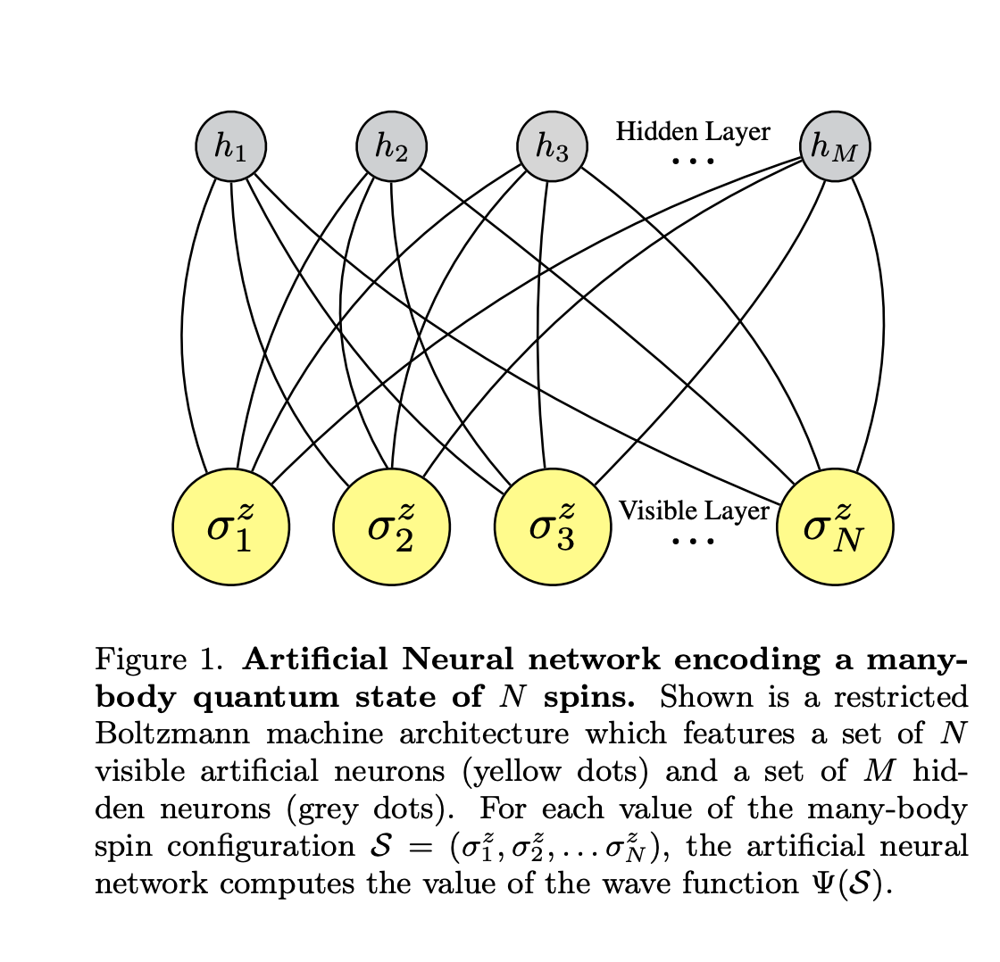
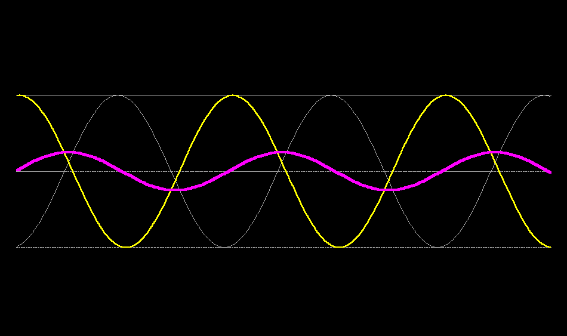

# Awesome Quantum Chemistry
*A curated list of awesome quantum chemistry frameworks, libraries, software and resources.*

## Tools 


#### [DeepQMC/PauliNet](https://deepqmc.github.io/index.html) 

*Deep-learning quantum Monte Carlo for electrons in real space*

  * [ :bookmark_tabs: Publication](https://arxiv.org/pdf/1909.08423.pdf): (2020) Deep-neural-network solution of the electronic Schrödinger equation
  * [:floppy_disk: Github](https://github.com/deepqmc/deepqmc)

#### [FermiNet](https://deepmind.com/blog/article/FermiNet)

*Implementation of the Fermionic Neural Network for ab-initio electronic structure calculations*

  * [:bookmark_tabs: Publication](https://arxiv.org/abs/1909.02487): (2020) Ab-Initio Solution of the Many-Electron Schrödinger Equation with Deep Neural Networks

  * [:floppy_disk: GitHub Code](https://github.com/deepmind/ferminet)

#### [Hande](http://www.hande.org.uk/ent)

*Highly parallel code for stochastic quantum chemistry. Can be used as standalone program or library from an existing quantum chemistry code.*

  * [:bookmark_tabs:  Publication](https://pubs.acs.org/doi/10.1021/acs.jctc.8b01217)
  * [:floppy_disk: : GitHub](https://github.com/hande-qmc/hande)

#### [PySCF](http://pyscf.org/) 

*Simple, lightweight, and efficient python platform for quantum chemistry calculations and methodology development.*

  * [:bookmark_tabs: Publication](https://authors.library.caltech.edu/74078/1/1701.08223.pdf)
  * [:bookmark_tabs: Documentation](http://pyscf.org/pyscf/overview.html)
  * [:floppy_disk: Github](https://github.com/pyscf/pyscf)
  * [:floppy_disk: mpi4pyscf](https://github.com/pyscf/mpi4pyscf) - Message Passing Interface parallelism

#### [PSi4](https://psicode.org/) 

*Suite of ab initio quantum chemistry programs designed for efficient, high-accuracy simulations of molecular properties*

  * [:bookmark_tabs: Documentation](https://psicode.org/psi4manual/master/index.html)
  * [:floppy_disk: Github](https://github.com/psi4/psi4/)

#### [QMCTorch](https://qmctorch.readthedocs.io/en/latest/) 

*Pytorch Implementation of Real Space Quantum Monte Carlo Simulations of Molecular Systems*
  * [:floppy_disk: Github](https://github.com/NLESC-JCER/QMCTorch)

#### [NWChem](https://www.nwchem-sw.org/)

## Machine Learning the Schrodinger Equation

 

[source](https://youtu.be/_bdvpmleAgw)

## [Solving the Quantum Many-Body Problem with Artificial Neural Networks (2016)](https://arxiv.org/pdf/1606.02318.pdf)

> In principle, an exponential amount of information is needed to fully encode a generic [many-body quantum state](https://youtu.be/uTCeQHzQMdc).

> However, Nature often proves herself benevolent, and a [wave function](https://phys.libretexts.org/Bookshelves/University_Physics/Book%3A_University_Physics_(OpenStax)/Book%3A_University_Physics_III_-_Optics_and_Modern_Physics_(OpenStax)/07%3A_Quantum_Mechanics/7.02%3A_Wavefunctions) representing a physical many-body system can
be typically characterized by an amount of information much smaller than the maximum capacity of the corresponding [Hilbert space](https://youtu.be/g-eNeXlZKAQ). A limited amount of [quantum entanglement](https://www.quantamagazine.org/entanglement-made-simple-20160428/), as well as the typicality of a small number of physical states, are then the blocks on which modern approaches build upon to solve the many-body [Schrödinger’s equation](https://plus.maths.org/content/schrodinger-1) with a limited amount of classical resources.



# FermiNet

FermiNet is the implementation of the (2020) paper ["Ab-Initio Solution of the Many-Electron Schroedinger Equation with Deep Neural Networks"](https://arxiv.org/pdf/1909.02487.pdf)

It is a neural network for learning the ground state [wavefunctions](https://phys.libretexts.org/Bookshelves/University_Physics/Book%3A_University_Physics_(OpenStax)/Book%3A_University_Physics_III_-_Optics_and_Modern_Physics_(OpenStax)/07%3A_Quantum_Mechanics/7.02%3A_Wavefunctions) of atoms and molecules using a [variational Monte Carlo](https://pubs.acs.org/doi/10.1021/acs.jctc.0c00147) approach.

 

## [Setup.py](https://github.com/deepmind/ferminet/blob/jax/setup.py)
FermiNet's setup file has some key dependencies that give us a peek into what is going on: 
* [Kfac](https://github.com/deepmind/deepmind-research/tree/master/kfac_ferminet_alpha) specific to fermiNet which is different than [TensorFlow Kfac](https://github.com/tensorflow/kfac) -- [Kfac Paper](https://arxiv.org/pdf/1503.05671.pdf) :blue_book: 
* [Jax](https://github.com/google/jax)
* [ML Collections](https://github.com/google/ml_collections)
* [Optax](https://github.com/deepmind/optax)
* [PyScf](https://github.com/pyscf/pyscf/)


## [Base Config.py](https://github.com/deepmind/ferminet/blob/jax/ferminet/base_config.py)

The base_config.py file lets the user set the system and hyperparameters.

#### enum

The code begins: 
```python
import enum
import ml_collections
from ml_collections import config_dict
```

Simmilar to [enums in to C++ 11](https://en.cppreference.com/w/cpp/language/enum):
```c++
// color may be red (value 0), yellow (value 1), green (value 20), or blue (value 21)
enum color
{
    red,
    yellow,
    green = 20,
    blue
};
```

[Python enums](https://docs.python.org/3/library/enum.html) introduced in  >= python 3.4 are a set of symbolic names (members) bound to unique, constant values:

```python
class NBA_ORG_RANKING(Enum):
  CELTICS = 7
  JAZZ = 4
  KNICKS = 31
  NETS = 1
```

FermiNet instantiates classes using enum. The code continues:

```python
class SystemType(enum.IntEnum):
  MOLECULE = 0
```
[IntEnum](https://docs.python.org/3/library/enum.html#enum.IntEnum) creates enumerated constants that are also subclasses of the [int](https://docs.python.org/3/library/functions.html#int) class.

"Members of an IntEnum can be compared to integers; by extension, integer enumerations of different types can also be compared to each other...However, they can’t be compared to standard Enum enumerations:

```python
from enum import Enum
from enum import IntEnum

class Knicks(IntEnum):
  RANDLE = 1
  BARRETT = 2
  NTILIKINA = 3

class Nets(Enum):
  DURANT = 1
  IRVING = 2
  HARDEN = 3

print(Knicks.RANDLE == Nets.DURANT)
>> False
```
#### @classmethod decorator

The code continues: 
```python
class SystemType(enum.IntEnum):
  MOLECULE = 0

  @classmethod
  def has_value(cls, value):
    return any(value is item or value == item.value for item in cls)
```

The [@classmethod](https://stackoverflow.com/questions/12179271/meaning-of-classmethod-and-staticmethod-for-beginner) decorator:

> "...take a cls parameter that points to the class—and not the object instance—when the method is called." [source](https://realpython.com/instance-class-and-static-methods-demystified/)

> "Because the class method only has access to this cls argument, it can’t modify object instance state. That would require access to self. However, class methods can still modify class state that applies across all instances of the class." [source](https://realpython.com/instance-class-and-static-methods-demystified/)

What we have here is the [factorymethod](https://en.wikipedia.org/wiki/Factory_method_pattern#:~:text=From%20Wikipedia%2C%20the%20free%20encyclopedia,object%20that%20will%20be%20created.) design pattern.


```python
class Nets:
  def __init__(self, skills):
    self.skills = skills

  def __repr__(self):
    return f'Nets({self.skills!r})'

  @classmethod
  def Joe_Harris(cls):
    return cls(['3Pts', 'drives'])

  @classmethod
  def Nic_Claxton(cls):
    return cls(['D', 'jams'])

print(Nets.Nic_Claxton())
print(Nets.Joe_Harris())

>> Nets(['D', 'jams'])
>> Nets(['3Pts', 'drives'])
```

In this example we can create new Players of the Nets class configured with the skills that we want them to have from a single __init__ but many constructors. Now the class (cls) is the first argument rather than the instance of the class (self). 

> "Another way to look at this use of class methods is that they allow you to define alternative constructors for your classes. Python only allows one __init__ method per class. Using class methods it’s possible to add as many alternative constructors as necessary." [source](https://realpython.com/instance-class-and-static-methods-demystified/)

### ml_collections ConfigDict

```python
def default() -> ml_collections.ConfigDict:
  """Create set of default parameters for running qmc.py.
  Note: placeholders (cfg.system.molecule and cfg.system.electrons) must be
  replaced with appropriate values.
  Returns:
    ml_collections.ConfigDict containing default settings.
  """
 ```
 
 Default returns a [mlcollections.ConfigDict]()
 
 > ConfigDict...is a "dict-like" data structure with dot access to nested elements...Supposed to be used as a main way of expressing configurations of experiments and models.

# PauliNet

## References 

(2020) ["Ab-Initio Solution of the Many-Electron Schroedinger Equation with Deep Neural Networks"](https://arxiv.org/pdf/1909.02487.pdf) - FermiNet

(2020) [Deep neural network solution of the electronic Schrödinger equation](https://arxiv.org/pdf/1909.08423.pdf) - PauliNet

(2020) [Variational Principles in Quantum Monte Carlo: The Troubled Story of Variance Minimization](https://pubs.acs.org/doi/10.1021/acs.jctc.0c00147)

(2020) [Fermionic neural-network states for ab-initio electronic structure](https://www.nature.com/articles/s41467-020-15724-9)

(2020) [Data Driven Science & Engineering:Machine Learning, Dynamical Systems and Control](http://databookuw.com/)

(2019) [Quantum Entanglement in Deep Learning Architectures](https://arxiv.org/pdf/1803.09780.pdf)

(2016) [Solving the Quantum Many-Body Problem with Artificial Neural Networks](https://arxiv.org/pdf/1606.02318.pdf)

(2015) [Optimizing Neural Networks with Kronecker-factored Approximate Curvature](https://arxiv.org/abs/1503.05671)
